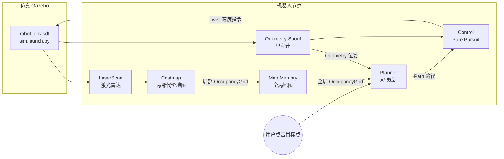

# 系统架构

## 总体数据流



## 话题拓扑

| 话题 | 类型 | 发布者 → 订阅者 |
|---|---|---|
| `/scan` | `sensor_msgs/LaserScan` | 仿真 → Costmap |
| `/local_costmap` | `nav_msgs/OccupancyGrid` | Costmap → Map Memory |
| `/global_map` | `nav_msgs/OccupancyGrid` | Map Memory → Planner |
| `/odom` | `nav_msgs/Odometry` | Odometry Spoof → Planner / Control / Map Memory |
| `/clicked_point` | `geometry_msgs/PointStamped` | Foxglove 用户点击 → Planner |
| `/mission_goals` | `nav_msgs/Path` | 用户/Foxglove 多点任务 → Mission Manager |
| `/goal_reached` | `std_msgs/Bool` | Planner → Mission Manager（到达反馈，推进队列） |
| `/stuck_alert` | `std_msgs/Bool` | Control → Mission Manager（卡死告警，触发重试） |
| `/mission_status` | `std_msgs/String` | Mission Manager → Foxglove（任务状态 JSON） |
| `/plan` | `nav_msgs/Path` | Planner → Control |
| `/cmd_vel` | `geometry_msgs/Twist` | Control → 仿真底盘 |

## 关键坐标系约定

系统中有三个坐标系（**frame**（音标 /freɪm/：Frame 坐标系：ROS 中 TF2 变换树的参考系节点））：

1. **`sim_world`** —— 世界坐标系，全局地图与路径均以此为准
2. **`base_link`** —— 车体坐标系，激光雷达局部地图建在此系
3. **栅格索引系** —— 每张 OccupancyGrid 内部的一维数组坐标

三者之间的换算由各模块内的 `worldToGrid` / `gridToWorld` / 刚体变换完成，不依赖 ROS 的 TF 树（简化实现，由 odometry_spoof 直接提供全局位姿）。

## 分层设计

每个包都是 `node + core` 双层结构：

```
control/
├── include/control_node.hpp   # ROS 面向层：订阅器/发布器/定时器
├── include/control_core.hpp   # 纯算法层：无 ROS 依赖
└── src/control_core.cpp       # 算法实现，可独立单元测试
```

这样设计的好处：

- **可测试性**：core 层可以直接对算法函数做单元测试，不需要起 ROS 上下文
- **可复用**：换一台机器人或换仿真器，只改 node 层
- **可读性**：算法逻辑不被 ROS API 噪声淹没

## 下一节

- [Costmap 局部代价地图](./costmap) → 感知层详解
